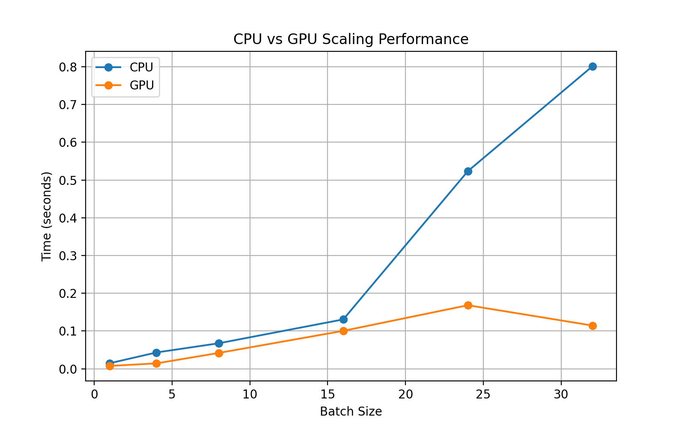

# Edge Detection Benchmark (CPU vs GPU)

This project benchmarks **CPU vs GPU** performance on classic image-processing filters using **PyTorch**:

- Convert to **grayscale**
- Apply **Gaussian blur**
- Run **Sobel edge detection**

It includes both:
- A **Python script** (`image_pipeline.py`) for experiments + benchmarking
- A **Streamlit web app** (`app.py`) where users can upload images and see results live

---

## Features
- Process single or multiple images
- Automatic handling of CPU vs GPU (with fallback if no GPU available)
- Batch scaling experiments with timing plots
- Streamlit web app for drag-and-drop usage
- Saves results (`.png`, `.csv`)

---

## Setup

### 1. Clone this repository
```bash
git clone https://github.com/AfuaX/edge-detection-benchmark.git
```

### 2. Create a virtual environment
```bash
python -m venv .venv
```

### 3. Activate the venv
- **Windows (PowerShell):**
  ```powershell
  .\.venv\Scripts\Activate.ps1
  ```
- **Command Prompt (cmd.exe):**
  ```bat
  .venv\Scripts\activate.bat
  ```

### 4. Install dependencies
```bash
pip install -r requirements.txt
```

---

## Usage

### Run the Streamlit app
```bash
streamlit run app.py
```
Open [http://localhost:8501](http://localhost:8501) in your browser.  
Upload images and compare CPU vs GPU results interactively.

### Run the benchmark script
```bash
python image_pipeline.py
```
This will:
- Process images from the `images/` folder (or generate synthetic ones)
- Save outputs like `cpu_edges.png`, `gpu_edges.png`
- Generate `scaling_results.csv` and `scaling_results.png`

---

## Example Outputs

### CPU Pipeline
| Original | CPU Edges |
|----------|-----------|
|  |  |

### GPU Pipeline (CUDA)
| Original | GPU Edges (CUDA) |
|----------|------------------|
|  |  |

### Scaling Performance


---

## 🛠️ Requirements
- Python 3.10+
- PyTorch with **CUDA** support (for GPU acceleration)
- Streamlit
- Pandas, Numpy, Matplotlib, Pillow

See [requirements.txt](requirements.txt) for the full list.

---

## Key Insights
- GPU acceleration with **CUDA** provides massive speedups on large image batches  
- CPU fallback ensures the pipeline runs on any machine  

---

## License
MIT License.  
Feel free to fork, modify, and experiment

---

## Acknowledgements
- [PyTorch](https://pytorch.org)
- [Streamlit](https://streamlit.io)
- [CUDA Toolkit](https://developer.nvidia.com/cuda-toolkit)
